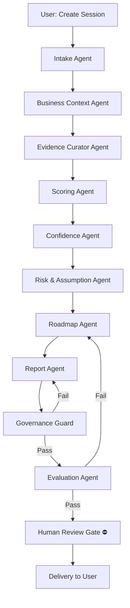
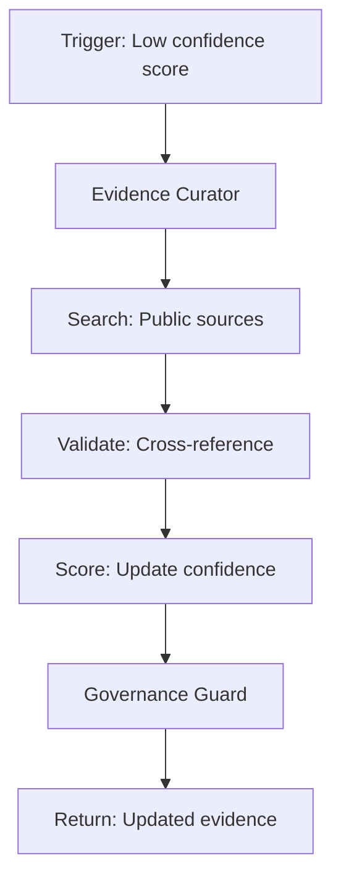
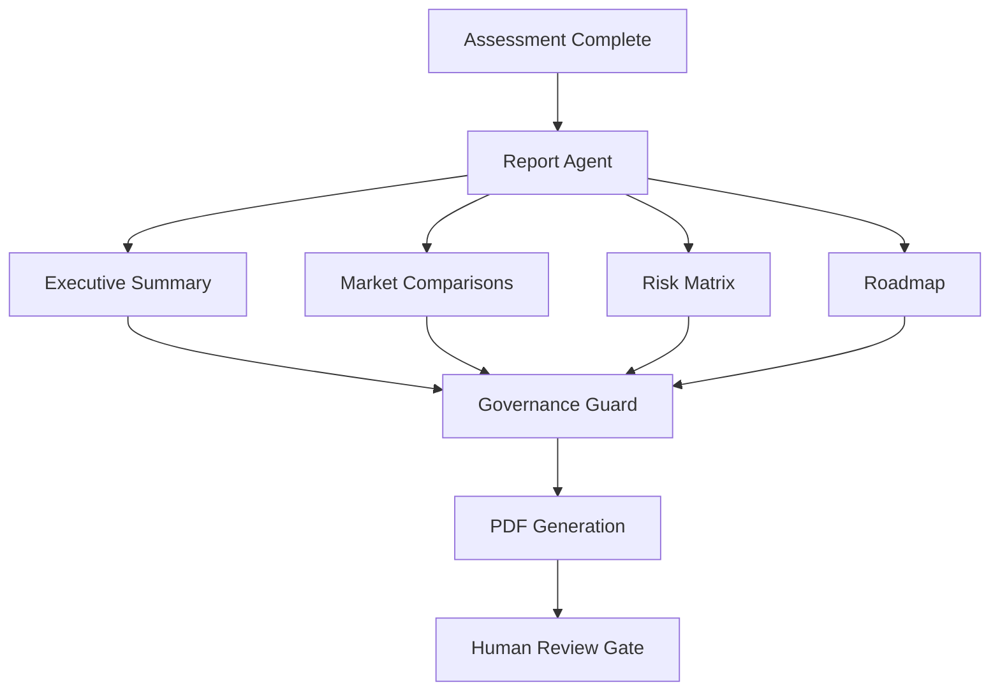

# MEP-light™ — ADK Agent Workflow Design

**Version**: 4.0  
**Date**: 2026-07-03  

---

## Workflow 1: Market Assessment (Primary)

### Phase Definitions

| Phase | Agent | Input | Output | Human Gate |
|-------|-------|-------|--------|------------|
| 1 | Intake | User form data | Validated session config | No |
| 2 | Business Context | Session config | Company + market context | No |
| 3 | Evidence Curator | Context + markets | Evidence ledger entries | No |
| 4 | Scoring | Evidence + dimensions | Raw 9-dimension scores | No |
| 5 | Confidence | Scores + evidence | Confidence labels + warnings | No |
| 6 | Risk & Assumption | Scores + confidence | Risk cards + assumption cards | No |
| 7 | Roadmap | Analysis complete | 30-60-90 day actions | No |
| 8 | Report Composition | All above | Draft report sections | No |
| 9 | Governance Guard | Draft report | Pass/fail + violation codes | No |
| 10 | Evaluation QA | Report | Quality score | No |
| 11 | Human Review | Final report | **Approved / Rejected** | **YES** |
| 12 | Delivery | Approved report | PDF + dashboard | No |

---

## Workflow 2: Evidence Research

### Trigger Conditions
- Evidence confidence < `Medium` for any dimension
- User requests "deep research" on a market
- Assumption card marked "critical"

---

## Workflow 3: Report Generation

---

## Workflow 4: SDLC Automation (Internal)

| Step | Agent | Action |
|------|-------|--------|
| 1 | SDLC Agent | Generate test plan from requirements |
| 2 | SDLC Agent | Generate deployment checklist |
| 3 | SDLC Agent | Generate security review template |
| 4 | Governance | Validate all outputs |

---

## Failure Handling

| Failure Type | Response | Retry | Escalation |
|-------------|----------|-------|------------|
| Agent timeout (>30s) | Cancel, log, return partial | 1 retry | Mark session "error" |
| Governance violation | Return to composition agent | 2 retries | Human review required |
| LLM API error | Exponential backoff | 3 retries | Fallback to deterministic scoring |
| Token limit exceeded | Chunk input, run in stages | 1 retry | Alert user, suggest simplification |
| Database error | Transaction rollback | 1 retry | Mark session "error", alert ops |

---

## Human Gate Specification

| Gate | When | Who | Actions Available |
|------|------|-----|-------------------|
| Pre-Report Delivery | After governance pass | Consultant (Admin) | Approve / Reject / Edit |
| Evidence Override | After evidence research | Consultant | Accept / Reject sources |
| Score Override | After automated scoring | Consultant | Adjust dimensions (logged) |

> **Charter Compliance**: All human gates align with MEP charter principle "Clarify Preparedness, Do Not Predict Success." No agent may bypass a human gate.
