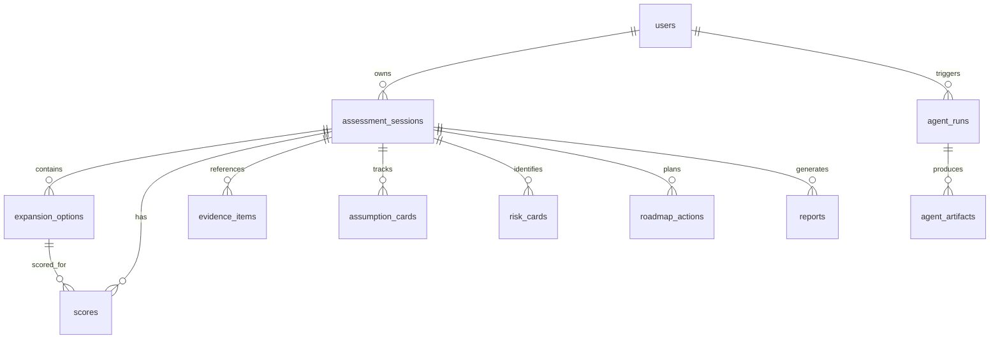

# MEP-light™ — Data Model Document

**Version**: 4.0 | **Date**: 2026-07-03

---

## Entity Relationship Diagram

## 13-Entity Schema

| # | Entity | Table Name | Primary Key | FK Dependencies |
|---|--------|-----------|-------------|-----------------|
| 1 | User | `users` | `id` | — |
| 2 | Company | `companies` | `id` | — |
| 3 | Assessment Session | `assessment_sessions` | `id` | `users.id` |
| 4 | Expansion Option | `expansion_options` | `id` | `assessment_sessions.id` |
| 5 | Score | `scores` | `id` | `assessment_sessions.id`, `expansion_options.id` |
| 6 | Evidence Item | `evidence_items` | `id` | `assessment_sessions.id` |
| 7 | Assumption Card | `assumption_cards` | `id` | `assessment_sessions.id` |
| 8 | Risk Card | `risk_cards` | `id` | `assessment_sessions.id` |
| 9 | Roadmap Action | `roadmap_actions` | `id` | `assessment_sessions.id` |
| 10 | Report | `reports` | `id` | `assessment_sessions.id` |
| 11 | Audit Event | `audit_events` | `id` | — (soft FK) |
| 12 | Agent Run | `agent_runs` | `id` | `assessment_sessions.id`, `users.id` |
| 13 | Agent Artifact | `agent_artifacts` | `id` | `agent_runs.id` |

## Key Columns per Entity

### `users`
| Column | Type | Constraints |
|--------|------|------------|
| `id` | VARCHAR(64) | PK |
| `email` | VARCHAR(255) | UNIQUE, NOT NULL |
| `role` | VARCHAR(50) | NOT NULL, DEFAULT 'Viewer' |
| `status` | VARCHAR(50) | NOT NULL, DEFAULT 'active' |
| `provider` | VARCHAR(50) | NOT NULL, DEFAULT 'google' |
| `last_login_at` | TIMESTAMPTZ | NULL |

### `assessment_sessions`
| Column | Type | Constraints |
|--------|------|------------|
| `id` | VARCHAR(64) | PK |
| `user_id` | VARCHAR(64) | FK → users.id ON DELETE CASCADE |
| `status` | VARCHAR(50) | NOT NULL, DEFAULT 'draft' |
| `active_state` | VARCHAR(50) | NOT NULL, DEFAULT 'SETUP' |
| `input_data` | JSONB | DEFAULT '{}' |
| `output_data` | JSONB | DEFAULT '{}' |

### `scores`
| Column | Type | Notes |
|--------|------|-------|
| 9 raw dimensions | INTEGER | Values 1-5, CHECK constraints |
| `expansion_potential_score` | INTEGER | Computed 0-100 |
| `tier_classification` | VARCHAR(10) | A/B/C/D |
| `risk_level` | VARCHAR(20) | Low/Moderate/High/Critical |
| `warnings` | JSONB | Array of warning objects |

## Indexes

| Table | Index | Columns |
|-------|-------|---------|
| `users` | `idx_users_email` | `email` |
| `assessment_sessions` | `idx_sessions_user` | `user_id` |
| `assessment_sessions` | `idx_sessions_status` | `status` |
| `scores` | `idx_scores_session` | `session_id` |
| `evidence_items` | `idx_evidence_session_dim` | `session_id, dimension` |
| `audit_events` | `idx_audit_created` | `created_at` |
| `agent_runs` | `idx_agent_runs_session` | `session_id` |

## Cross-Runtime Consistency

| Python (SQLAlchemy) | TypeScript (db_client.ts) | SQL (migrations) |
|--------------------|--------------------------|--------------------|
| `User` model | `DbUser` interface | `users` table |
| `AssessmentSession` model | `DbSession` interface | `assessment_sessions` table |
| `AuditEvent` model | `DbAuditEvent` interface | `audit_events` table |
| `AgentRun` model | `recordAgentRun()` method | `agent_runs` table |
